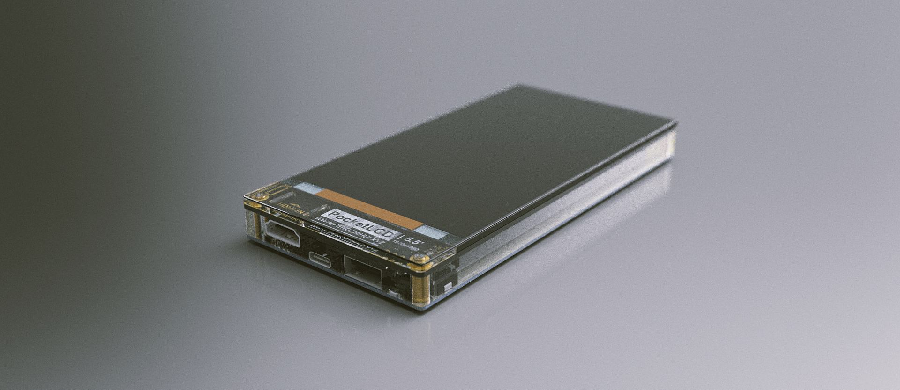
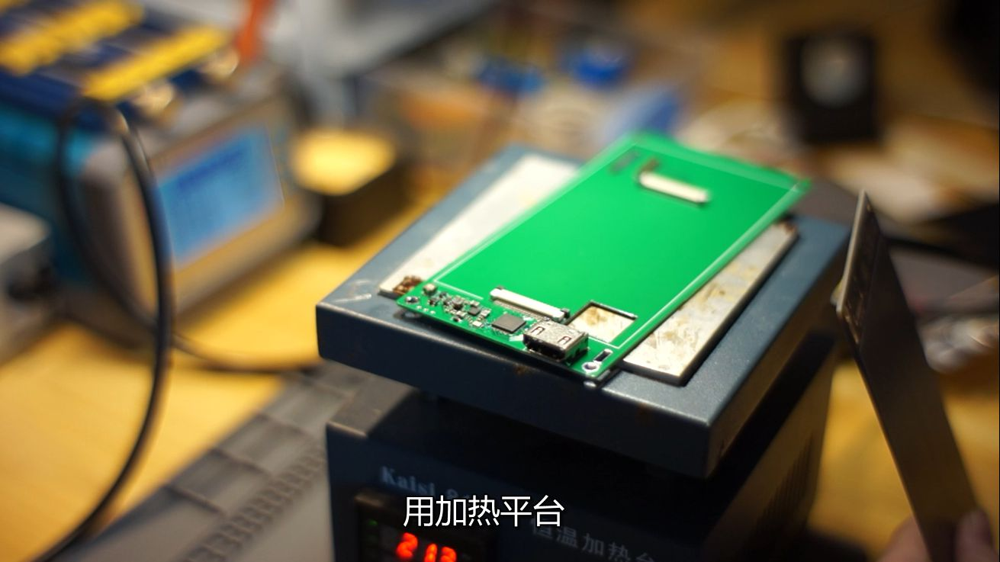

# PocketLCD: 带充电宝功能的便携显示器

项目的视频介绍可以在这里看： [【自制】你的下一个显示器，可能是个充电宝？？](https://www.bilibili.com/video/BV17D4y1X7AT)

总的来说，这是我最近为了解决个人痛点设计制作的一个便携口袋显示器，最终成品的完成度比较高所以也就顺便开源分享出来了。

> 其中屏幕显示部分是基于我之前开源另一个项目`HDMI-PI`，关联仓库地址在这里：
>
> https://github.com/peng-zhihui/HDMI-PI

## 关于屏幕选型

如视频介绍中所述，MIPI并不是一个通用的接口，需要针对不同的屏幕模组定制驱动固件，这一块比较复杂所以建议大家直接用我编译好的固件进行烧录。

屏幕的型号是5.5英寸的1080P IPS屏幕，我是在这里购买的（非广告）[5.5寸TFT屏 IPS 1080*1920 亮度300 MIPI ](https://item.taobao.com/item.htm?spm=a1z09.2.0.0.7f172e8dEWrdmp&id=543793236047)

价格不贵就100元，显示效果还是很理想的。

**喜欢的话记得给仓库点星星~**

> 另外强调一下，本仓库的项目是**GPL协议**，不支持任何形式的私自产品化（当然大家自己DIY是没有任何问题的，这里只是防止有人借我的名义坑大家），我个人工作比较忙所以也没有建任何官方的QQ、微信群等，大家自己加群的时候要注意甄别。